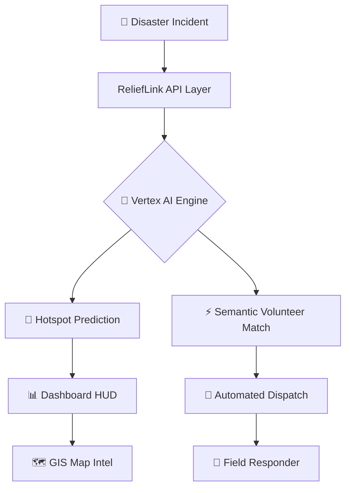

<div align="center">

# 🛰️ ReliefLink AI


### **Autonomous Crisis Coordination Command Center**

[](https://nextjs.org/)
[](https://cloud.google.com/vertex-ai)
[](https://react.dev/)
[](LICENSE)

**Scaling Global Disaster Response with Google Cloud Vertex AI**

[🚀 Live Demo](#) · [📹 Watch Video](#) · [📖 Documentation](#-architecture)

</div>

---

> **ReliefLink AI** transforms disaster management from *reactive* to *predictive*.  
> By leveraging **Google Cloud Vertex AI (Gemini 1.5 Flash)**, it autonomously coordinates field intelligence, dispatches responders, and forecasts crisis hotspots — all from a single tactical command center.

---

## 🌍 UN Sustainable Development Goals

<table>
<tr>
<td width="80" align="center">🏙️</td>
<td><strong>SDG 11 — Sustainable Cities & Communities</strong><br/>Enhancing disaster resilience and protecting the most vulnerable populations through intelligent resource allocation.</td>
</tr>
<tr>
<td width="80" align="center">🌿</td>
<td><strong>SDG 13 — Climate Action</strong><br/>Strengthening adaptive capacity to climate-related hazards and natural disasters with predictive AI.</td>
</tr>
</table>

---

## ✨ Key Features

<table>
<tr>
<td width="50%" valign="top">

### 📡 Elite GIS Situational Awareness
- 🎯 Tactical coordinate grid (50px precision)
- 📡 Satellite radar sweep animation
- 🔥 Pulsing crisis heat zones
- 🗺️ Interactive Target Intel cards

</td>
<td width="50%" valign="top">

### 🧠 Strategic Intelligence Engine
- 🔮 Predictive hotspot forecasting via **Vertex AI**
- ⚡ Autonomous volunteer dispatch
- 📊 Semantic skill-to-incident matching
- 📈 Real-time situational analysis

</td>
</tr>
<tr>
<td width="50%" valign="top">

### 💎 Premium UX Design
- 🧊 Glassmorphic panels (25px backdrop blur)
- ✨ Indigo-to-Cyan brand gradients
- ⚡ Shimmer skeleton loading states
- 🔔 Toast notification feedback system

</td>
<td width="50%" valign="top">

### 👥 Coordination Suite
- 👤 Deep volunteer profiles & deployment
- 💬 Integrated glassmorphic chat
- 📋 Incident tracking & management
- 📊 Analytics & performance dashboards

</td>
</tr>
</table>

---

## 🛠️ Tech Stack

| Layer | Technology |
|:---|:---|
| **Framework** | Next.js 16.2.3 (React 19) |
| **AI Engine** | Google Cloud Vertex AI — Gemini 1.5 Flash |
| **Styling** | Vanilla CSS — Glassmorphism + Outfit Typography |
| **State** | React Hooks + Server-side API Routes |
| **Auth** | GCP Service Account (JSON Key) |

---

## 🏗️ Architecture



---

## 🚦 Quick Start

### Prerequisites
- **Node.js** 18+
- A **Google Cloud Project** with [Vertex AI API](https://console.cloud.google.com/apis/library/aiplatform.googleapis.com) enabled

### Installation

```bash
# Clone the repository
git clone https://github.com/vaishnavi-ctrl-jpg/RELIEFLINK-AI-
cd RELIEFLINK-AI-

# Install dependencies
npm install
```

### Environment Setup

Create a `.env.local` file in the project root:

```env
GOOGLE_CLOUD_PROJECT=your-project-id
GOOGLE_CLOUD_LOCATION=us-central1
GOOGLE_APPLICATION_CREDENTIALS=./service-account-key.json
```

> 💡 **Need a Service Account?** Go to [IAM & Admin → Service Accounts](https://console.cloud.google.com/iam-admin/serviceaccounts), create one with the **Vertex AI User** role, and download the JSON key.

### Launch

```bash
npm run dev
```

Open [http://localhost:3000](http://localhost:3000) to access the Command Center.

---

## 📁 Project Structure

```
relieflink-ai/
├── app/
│   ├── api/
│   │   ├── match/          # Vertex AI Dispatch Engine
│   │   ├── intelligence/   # Predictive Analytics API
│   │   ├── request/        # Incident CRUD
│   │   └── volunteers/     # Responder Network
│   ├── components/
│   │   └── Sidebar.js      # Glassmorphic Navigation HUD
│   ├── map/                # Elite GIS Page
│   ├── incidents/          # Crisis Management
│   ├── volunteers/         # Responder Profiles
│   ├── analytics/          # Performance Dashboards
│   ├── settings/           # System Configuration
│   └── help/               # Coordination Support Hub
├── lib/
│   └── store.js            # In-memory Data Layer
└── public/                 # Static Assets & Profile Images
```

---

## 🎖️ The Vision

> *ReliefLink AI aims to be the open-source standard for crisis coordination — ensuring no call for help goes unanswered.*

---

<div align="center">

**Developed for the Google Solution Challenge 2026**

Made with 💜 by [Vaishnavi](https://github.com/vaishnavi-ctrl-jpg)

</div>
